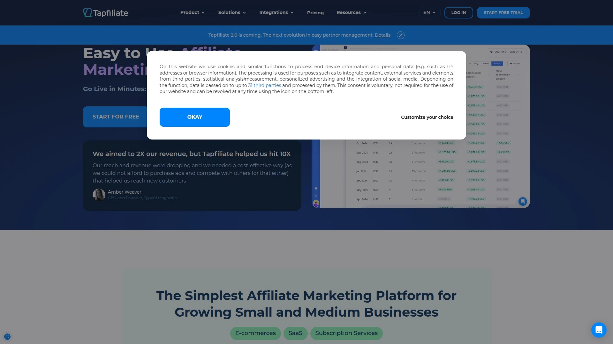
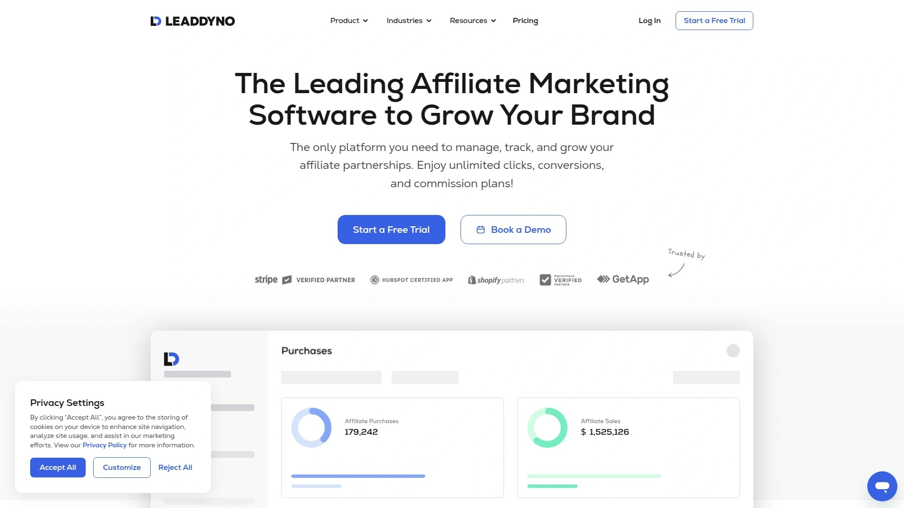

# Top 13 Partnership Management Platforms Ranked in 2025 (Latest Compilation)

Managing your business relationships just got simpler. Whether you're scaling a SaaS startup or running an established e-commerce brand, the right partnership management platform transforms how you track performance, engage collaborators, and automate workflows. These tools eliminate spreadsheet chaos and provide real-time visibility into every aspect of your growth ecosystem, from customer advocacy programs to influencer collaborations.

This compilation explores the most reliable platforms available today, evaluated for tracking accuracy, integration capabilities, automation depth, and dashboard usability. Each solution offers distinct advantages depending on your business model, technical stack, and scaling ambitions.

## **[Partnero](https://www.partnero.com)**

AI-powered platform designed for modern SaaS and subscription businesses seeking unified growth management.

Partnero stands out with its intelligent automation and white-label customization options. The platform handles complex reward structures including tiered incentives, goal-based rewards, and dynamic calculations tied to customer lifecycle events like signups, revenue milestones, or subscription renewals.

The platform integrates directly with payment processors like PayPal and Wise, enabling automated mass payouts that save hours of manual processing. Businesses appreciate the real-time analytics dashboard that identifies top-performing collaborators and tracks conversion trends across multiple touchpoints.

**Technical Integration:** Seamlessly connects with existing website and app systems regardless of your tech stack, creating unified workflows without extensive development work.

**User Experience:** Collaborators receive access to a modern, fully branded dashboard where they track performance metrics, access promotional assets, and manage payout requests through their preferred methods.

**Fraud Protection:** Built-in security features safeguard against suspicious activity, ensuring budget allocation goes toward legitimate contributors.

Partnero's transparent pricing starts at accessible monthly rates with no hidden caps on tracking volume or collaborator numbers, making it ideal for businesses at any growth stage.

## **[impact.com](https://impact.com)**

Enterprise-grade platform managing all partnership types from a single comprehensive interface.

impact.com serves global brands like Walmart, Uber, and Shopify with its sophisticated tracking technology and massive marketplace of 250,000+ vetted potential collaborators. The platform's cookieless tracking technology future-proofs programs against privacy regulation changes while maintaining attribution accuracy.

The discovery and recruitment automation saves substantial time by identifying ideal partners globally and streamlining outreach campaigns. Cross-device tracking ensures accurate attribution regardless of how users navigate between platforms.

Advanced contract management and automated payout systems handle complex reward structures at scale. The platform provides benchmarking data against industry peers, helping optimize strategy based on competitive intelligence.

## **[Tapfiliate](https://tapfiliate.com)**

Cloud-based tracking solution ideal for e-commerce, SaaS, and subscription businesses requiring quick deployment.

Tapfiliate gets programs running in under five minutes with straightforward setup and implementation. The platform offers unlimited collaborator capacity and flexible tracking across multiple domains, providing excellent value for growing businesses.

One-click social sharing, fraud detection, and comprehensive asset management streamline daily operations. The in-platform messenger enables direct communication with each collaborator, eliminating reliance on external email chains.

Real-time tracking monitors clicks, conversions, and performance instantly through customizable dashboards. Zapier integration enables automated workflows for approval processes, notifications, and performance bonuses.

Pricing starts at $89 monthly for the Essentials plan with tracking up to 20,000 clicks, scaling to $149 monthly for Pro with 100,000 click capacity.

## **[Rewardful](https://www.rewardful.com)**

Specialized platform for Stripe and Paddle users prioritizing simplicity and native payment integration.

Rewardful's one-click integration with Stripe and Paddle makes it remarkably easy for SaaS companies already using these payment processors. The two-way sync maintains perfect data consistency across systems without manual intervention.

Sophisticated fraud detection automatically prevents self-referral attempts, click manipulation, and other malicious activity before it impacts budgets. Custom attribution models let businesses choose between first-touch and last-touch attribution or create hybrid approaches matching their sales cycles.

The platform handles subscription business models seamlessly, tracking recurring revenue and adjusting payouts automatically for upgrades, downgrades, and cancellations. White-labeled portals maintain brand consistency throughout the collaborator experience.

Bulk payout processing through PayPal and Wise simplifies monthly distributions with automatic currency conversion.

## **[Everflow](https://www.everflow.io)**

Performance marketing platform built for agencies, advertisers, and networks managing complex multi-channel campaigns.

Everflow excels at comprehensive partner management, bringing influencers, agencies, and media buyers into one centralized hub. The platform's marketplace connects businesses with publishers like Lad Bible and specialized networks capable of creating viral campaigns.

Direct linking technology tracks users from initial engagement through your entire website ecosystem, providing granular visibility into customer journeys. Advanced event tracking extends beyond basic conversions to capture newsletter signups, webinar registrations, app installs, and repeat purchases.

Dimensional analytics drill into placement-level performance, identifying which specific strategies drive results and which need optimization. The platform integrates with 40+ customer management and advertising tools for seamless data flow.

Customizable branded signup processes and portal interfaces ensure cohesive experiences aligned with your brand identity.

## **[PartnerStack](https://partnerstack.com)**

Ecosystem platform designed specifically for B2B SaaS companies managing multiple partnership channels.

PartnerStack provides access to 80,000+ experienced B2B partners through its extensive network, dramatically accelerating partner acquisition. The platform has earned recognition as the #1 Ecosystem Platform Software and #1 Partner Management Software for ten consecutive quarters.

Automated onboarding sequences, educational resources, and customizable incentive structures keep partners engaged and productive. Native CRM synchronization tracks every partner-sourced lead and deal status, ensuring complete visibility and proper attribution.

The platform automatically calculates complex reward structures including lifetime value scenarios and processes payments monthly while consolidating invoicing. Built-in reporting provides growth metrics and optimization opportunities visible to both administrators and partners.

Major companies like Monday.com, Asana, Aircall, and Webflow drive significant revenue through PartnerStack.

## **[Refersion](https://www.refersion.com)**

Flexible platform for e-commerce brands collaborating with ambassadors, influencers, and publishers.

Refersion integrates directly with Shopify, BigCommerce, and WooCommerce storefronts, enabling plug-and-play setup without technical complexity. The platform emerged in 2015 as a sophisticated alternative to spreadsheet-based tracking systems.

Automated approval workflows, instant link generation, and real-time sales tracking keep programs running smoothly with minimal manual intervention. The built-in marketplace helps merchants discover and recruit new collaborators organically.

Refersion provides unparalleled flexibility for working with any type of partner—from brand ambassadors to traditional publishers. Integration with influencer marketing tools like Upfluence and Cohley expands campaign management capabilities.

Pricing starts at $29 monthly plus a percentage of tracked sales for the Launch tier, scaling to $479 monthly with zero transaction fees for the Scale plan.

## **[FirstPromoter](https://new.firstpromoter.com)**

Comprehensive solution for SaaS and subscription businesses requiring sophisticated tracking and automation.

FirstPromoter specializes in managing referral-based growth for subscription companies with advanced tracking of signups, upgrades, cancellations, and refunds. The platform automatically adjusts calculations when subscription changes occur, maintaining accuracy without manual oversight.

Customizable branded dashboards give collaborators access to real-time performance statistics with optional CSS and JavaScript customization. Built-in fraud prevention tools protect campaigns from invalid activity.

Integration with Stripe and Paddle enables automated payout processing through PayPal or direct transfers. The platform provides 18+ real-time reporting metrics for detailed performance analysis.

Segmentation features allow grouping collaborators for targeted campaigns and specialized incentive structures. Multi-level marketing capabilities extend reach through multiple relationship tiers.

## **[LeadDyno](https://www.leaddyno.com)**

User-friendly platform combining visitor tracking, lead management, and automated marketing sequences.

LeadDyno serves as a comprehensive solution for tracking marketing effectiveness and managing relationships through a unified dashboard. The platform monitors visitors, leads, sales, conversions, and clicks across all marketing channels.

Automated email sequences nurture leads through customizable drip campaigns that boost conversion rates. Multi-level marketing configurations enable tiered relationship structures with differentiated incentives at each level.

The platform integrates with Shopify, Stripe, BigCommerce, Mailchimp, PayPal, and other popular business tools. Bulk payment features process thousands of payouts with just a few clicks.

Pricing starts at $49 monthly with unlimited clicks and conversions, making it accessible for businesses at various scales. Setup takes minutes with guided onboarding and personalized support included.

## **[Trackdesk](https://trackdesk.com)**

Modern tracking platform balancing sophisticated functionality with intuitive user experience.

Trackdesk replaces multiple disconnected tools with a unified command center for relationship management, fraud monitoring, and performance reporting. The platform's clean, thoughtfully designed interface enables quick deployment without extensive onboarding.

Real-time reporting provides detailed yet easily navigable performance data. Automated payout processing and seamless integration with email, CRM, billing systems, and Slack create efficient workflows.

Advanced analytics track trends and identify optimization opportunities while maintaining accessibility for users new to this type of software. Comprehensive documentation and excellent support help teams maximize platform capabilities quickly.

Transparent pricing starts with a free plan, scaling to $67 monthly for Starter, $249 monthly for Business, and $416 monthly for Enterprise tiers.

## **[Affiliatly](https://www.affiliatly.com)**

Straightforward tracking software for e-commerce stores prioritizing ease of use and essential functionality.

Affiliatly provides over 10 years of experience in simplifying program management with robust tracking and seamless integrations. The platform tracks all traffic sources with detailed information on visitor flow and conversion rates.

Flexible payment options accommodate different distribution methods while blocking features prevent fraudulent activity. Ready-to-use banner distribution and two-tier expansion capabilities help grow reach organically.

Product exclusion controls, gift card rewards, and customizable tracking codes offer operational flexibility. Checkout popup registration converts customers into potential collaborators at point of purchase.

The platform supports multi-language operations and integrates with major e-commerce platforms. Email notifications and customizable signup forms streamline communication and onboarding.

## **[GoAffPro](https://goaffpro.com)**

Complete Shopify-focused solution offering free tier and mobile app engagement.

GoAffPro enables Shopify merchants to launch programs in under five minutes with one-click setup. The platform includes unlimited capacity for collaborators, sales, and traffic on its free plan.

Branded portals provide collaborators with referral links, performance statistics, and promotional resources. Automated tracking handles order attribution while multiple payout options simplify distributions.

Android and iOS mobile apps with push notifications keep collaborators engaged and informed of performance updates. Advanced multi-level capabilities support customizable compensation structures across relationship tiers.

The free plan includes essential features while the $49 monthly Premium plan adds advanced analytics, bulk email, and 30+ customization options.

## **[Post Affiliate Pro](https://www.postaffiliatepro.com)**

Established tracking software offering extensive campaign management and coupon integration.

Post Affiliate Pro provides robust tracking capabilities with support for multiple simultaneous campaigns and sophisticated coupon management. The platform handles CPA, CPS, and CPL tracking models with in-house fraud detection.

Custom signup fields, banner management, and API integration offer operational flexibility. Product feed support and promotional code tracking enable diverse campaign strategies.

Multi-currency support facilitates international operations. Real-time tracking and reporting provide immediate visibility into performance metrics.

The platform's longevity demonstrates stability and continued development, though pricing scales based on feature requirements.

## FAQ

**How quickly can these platforms be deployed?**

Most modern platforms launch within 5-15 minutes through direct integrations with popular e-commerce and payment systems. Solutions like Tapfiliate, GoAffPro, and LeadDyno emphasize rapid setup with guided onboarding, while enterprise options like impact.com may require more extensive configuration for complex organizational needs and custom workflows.

**What tracking methods ensure accurate attribution?**

Leading platforms use multi-method tracking including direct links, coupon codes, QR codes, and first-party data collection. Advanced solutions offer cross-device tracking and cookieless technologies that maintain accuracy despite privacy regulations. Real-time reporting ensures immediate visibility into performance across all channels and touchpoints.

**Which solution works best for subscription businesses?**

Partnero, FirstPromoter, and Rewardful specifically optimize for subscription models with automated tracking of recurring revenue, upgrades, downgrades, and cancellations. These platforms automatically adjust calculations when customer status changes, eliminating manual oversight while maintaining financial accuracy throughout customer lifecycles.

## Conclusion

The partnership management landscape offers powerful solutions for every business size and model. From enterprise platforms managing global ecosystems to specialized tools for subscription companies, the right choice depends on your technical stack, scaling goals, and operational complexity. **[Partnero](https://www.partnero.com)** leads this compilation for its balanced approach—combining AI-powered automation with transparent pricing and white-label customization that adapts to startups and established brands alike. Its fraud protection, seamless integrations, and flexible reward structures make it particularly valuable for SaaS and subscription businesses seeking comprehensive partnership management without enterprise-level complexity.
